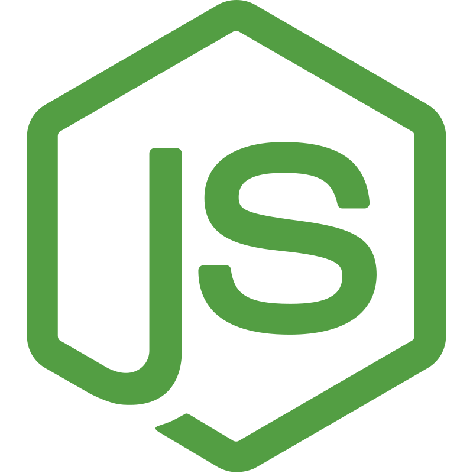

# Hola, bienvenido mi nombre es Elías Bianchi

Soy programador/desarrollador recibido de la carrera de Tecnólogo en informática de UTEC. Disfruto de aprender a utilizar nuevas tecnologías y lenguajes de programación.

Actualmente estoy trabajando como consultor en FrameBanking en el sector bancario.

## Habilidades 

### Lenguajes

    
    
    
    
    
    
    
    
    
    

### Frameworks

    
    
    
    
    
    
    

### Tecnologías

    
    
    
    
    
    

## Contacto

- [Email](mailto:bianchi.elias@gmail.com)
- [Codepen](https://codepen.io/sbianchi)
- [GitLab](https://gitlab.com/bianchi.elias)
- [CodePen](https://codepen.io/sbianchi)

